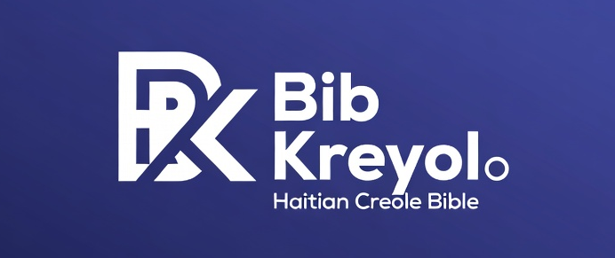

### Bib Kreyol · Bib la an Kreyòl

**Read and share Scripture in Haitian Creole—on Android, iPhone, and iPad.**

If this project helps you, please **[give the repo a star](https://github.com/bolividob/bibkreyol-comments-data)** — it helps others discover the app and this work.

---

### Download the app

| Platform | Link |
| -------- | ---- |
| **Google Play (Android)** | [Bib Kreyol on Google Play](https://play.google.com/store/apps/details?id=com.bolivido.bibkreyol&hl=en_US) |
| **App Store (iOS)** | [Bib Kreyol on the App Store](https://apps.apple.com/us/app/bib-kreyol-haitian-bible/id6447394074) |

### Media

- **YouTube:** [@BibKreyolMedia](https://www.youtube.com/@BibKreyolMedia)

---

## About this repository

This repo holds **static JSON** used by the Bib Kreyol app for **daily verse comments**, **Prayer Requests**, and related data (for example under `comments/daily/` and `prayer-requests/`). It is updated by automation (e.g. Firebase Cloud Functions + GitHub) when users interact through the app.

It is **not** the main application source code; it is the **published data** that clients read from hosting mirrors (Firebase Hosting, GitHub Pages, Cloudflare, etc.).

---

## Bib Kreyol (the app)

Bib Kreyol is a Haitian Creole Bible app: read the Bible offline, follow the verse of the day, engage with comments on the daily verse, and explore media from Bib Kreyol. The app is built to serve Haitian Creole speakers and anyone learning from Scripture in Kreyòl.

**Enjoying Bib Kreyol?** Rate us on the [Play Store](https://play.google.com/store/apps/details?id=com.bolivido.bibkreyol&hl=en_US) or [App Store](https://apps.apple.com/us/app/bib-kreyol-haitian-bible/id6447394074), subscribe on [YouTube](https://www.youtube.com/@BibKreyolMedia), and **star this repository** if the open data or tooling here is useful to you.

---

## Assets in this folder

| File | Description |
| ---- | ----------- |
| `assets/banner.png` | Wide banner (from the Bib Kreyol project branding) |
| `assets/logo.png` | App-style logo mark |
